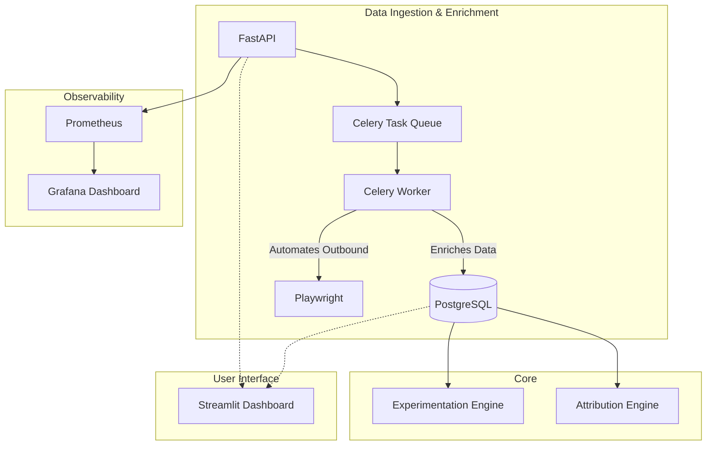

# JurisFlow Architecture

## System Overview

```mermaid
flowchart TD
    subgraph Data Ingestion & Enrichment
        API[FastAPI] --> Q[Celery Task Queue]
        Q --> Worker[Celery Worker]
        Worker --> |Enriches Data| DB[(PostgreSQL)]
        Worker --> |Automates Outbound| Browser[Playwright]
    end

    subgraph Core
        DB --> Experimentation[Experimentation Engine]
        DB --> Attribution[Attribution Engine]
    end

    subgraph User Interface
        API -.-> Dashboard[Streamlit Dashboard]
        DB -.-> Dashboard
    end

    subgraph Observability
        API --> Prom[Prometheus]
        Prom --> Grafana[Grafana Dashboard]
    end
```
